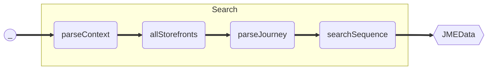

## Expectation

```mermaid
flowchart LR
    S((_))
subgraph Search

    E1(parseContext)
    E2(allStorefronts)
    E3(parseJourney)
    E4(searchSequence)
    
end

    Data{{"JMEData"}}

    S ==>  E1 ==> E2 ==> E3 ==> E4 ==> Data
```

