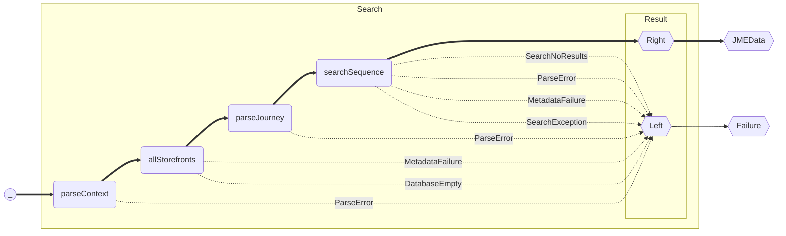

## ~~Expectation~~ Reality

```mermaid
flowchart LR
    S((_))
subgraph Search

    E1(parseContext)
    E2(allStorefronts)
    E3(parseJourney)
    E4(searchSequence)
    
    subgraph Result
        left{{Left}}
        right{{Right}}
    end
end


    Success{{"JMEData"}}
    Failure{{"Failure"}}

S ==> E1 ==> E2 ==> E3 ==> E4 ====> right ==> Success

E1 -.ParseError.-> left
E2 -.MetadataFailure.-> left
E2 -.DatabaseEmpty.-> left
E3 -.ParseError.-> left
E4 -.SearchNoResults.-> left
E4 -.ParseError.-> left
E4 -.MetadataFailure.-> left
E4 -.SearchException.-> left

left --> Failure

```

