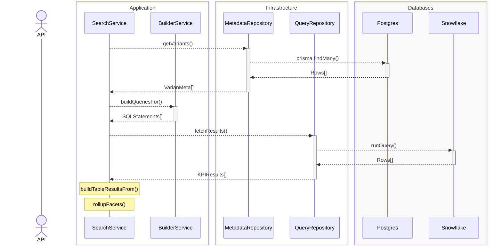

```mermaid
sequenceDiagram
    actor API

    box Application
    participant SearchService
    participant BuilderService
    end

    box Infrastructure
    participant MetadataRepository
    participant QueryRepository
    end

    box rgba(255,255,255,0.1) Databases
    participant Postgres
    participant Snowflake
    end

    SearchService-->>+MetadataRepository: getVariants()
    MetadataRepository-->>+Postgres: prisma.findMany()
    Postgres-->>-MetadataRepository: Rows[]
    MetadataRepository-->>-SearchService: VarianMeta[]
    SearchService-->>+BuilderService: buildQueriesFor()
    BuilderService-->>-SearchService: SQLStatements[]
    SearchService-->>+QueryRepository: fetchResults()
    QueryRepository-->>+Snowflake: runQuery()
    Snowflake-->>-QueryRepository: Rows[]
    QueryRepository-->>-SearchService: KPIResults[]
    
    Note over SearchService: buildTableResultsFrom()
    Note over SearchService: rollupFacets()

```
