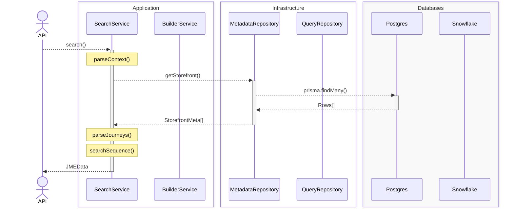

```mermaid
sequenceDiagram
    actor API

    box Application
    participant SearchService
    participant BuilderService
    end

    box Infrastructure
    participant MetadataRepository
    participant QueryRepository
    end

    box rgba(255,255,255,0.1) Databases
    participant Postgres
    participant Snowflake
    end

    API-->>+SearchService: search()
    Note over SearchService: parseContext()
    
    SearchService-->>+MetadataRepository: getStorefront()
    MetadataRepository-->>+Postgres: prisma.findMany()
    Postgres-->>-MetadataRepository: Rows[]
    MetadataRepository-->>-SearchService: StorefrontMeta[]
    
    Note over SearchService:parseJourneys()

    Note over SearchService: searchSequence()

    SearchService-->>-API: JMEData
```
