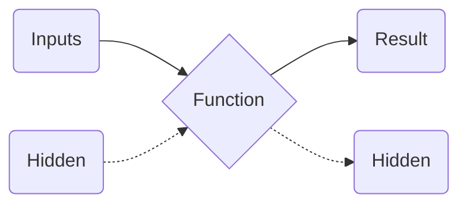

## "Every function you write has two sets of inputs and outputs"
~ Kris Jenkins

<v-click>

</v-click>

  <a href="https://youtu.be/_nG09Z_tdUU?si=eNeByH3ysQ2yvCc3" >Side-Effects Are The Complexity Iceberg • Kris Jenkins • YOW! 2024 </a>

